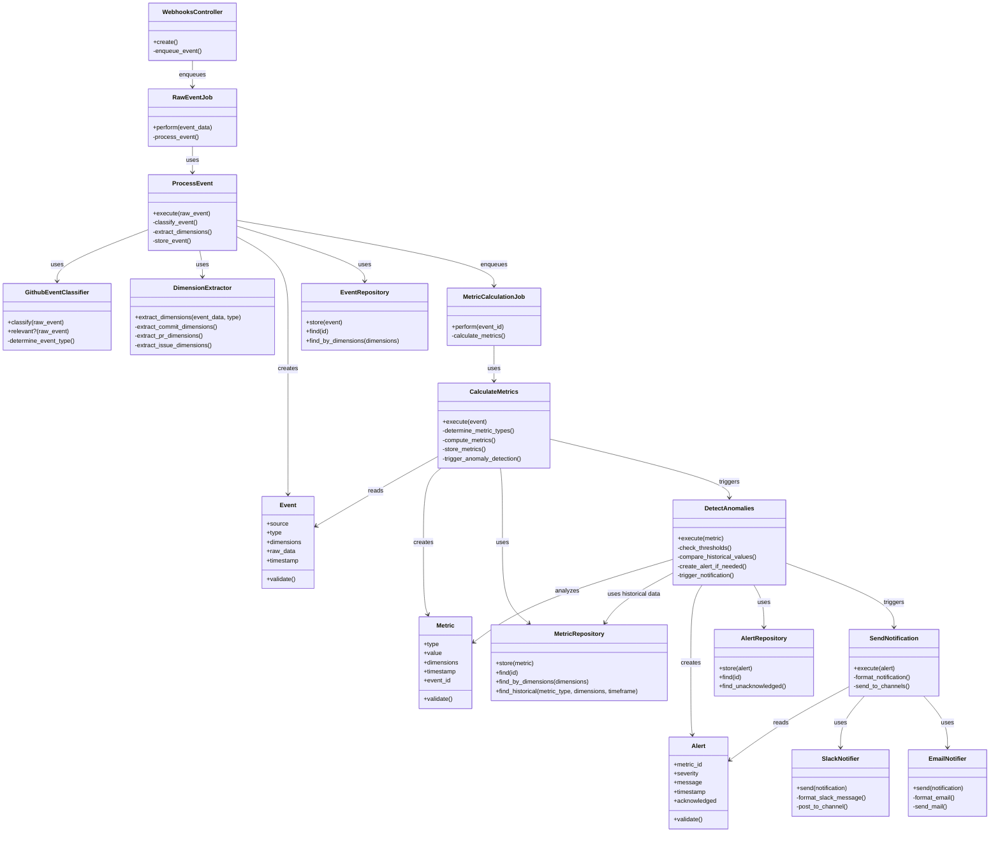

# ReflexAgent Code Level Diagram

This diagram provides a code-level view of the event processing pipeline in ReflexAgent, showing the classes and their relationships.

## Event Processing Pipeline (Code Level)

This code-level diagram illustrates the classes and their relationships involved in the event processing pipeline, from receiving an event via webhook, through processing, metric calculation, anomaly detection, to sending notifications. 

The class diagram aligns with the hexagonal architecture pattern:
- Core domain classes (Event, Metric, Alert, use cases)
- Adapters (repositories, notifiers)
- Clear flow of control and data through the system

This detailed view helps developers understand the concrete implementation of the event processing pipeline within the architectural context provided by the higher-level C4 diagrams. 