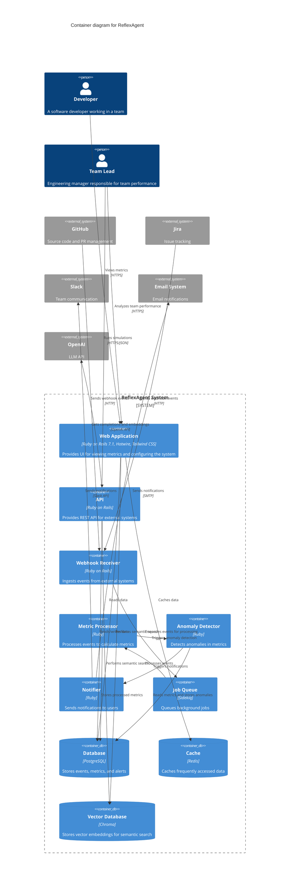

# ReflexAgent C4 Container Diagram

This diagram shows the containers (applications, data stores, etc.) that make up the ReflexAgent system and their interactions.

## Container Diagram

The container diagram shows the main components of the ReflexAgent system and how they interact with each other and external systems. The system follows a hexagonal architecture pattern with clear separation between the core domain, ports, and adapters. 