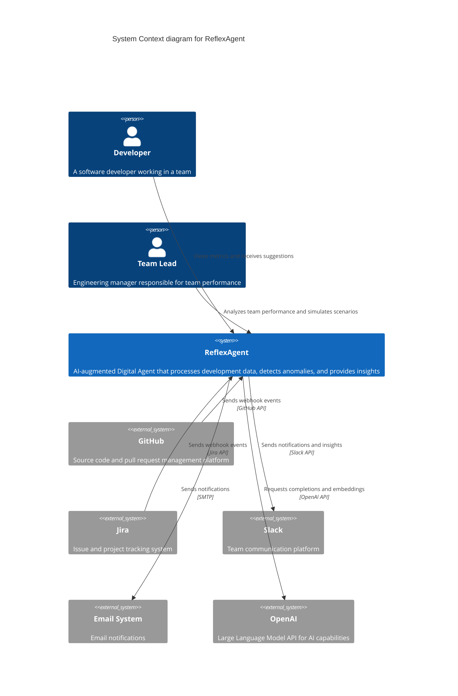

# ReflexAgent C4 Context Diagram

This diagram illustrates the high-level system context of the ReflexAgent application, showing how it interacts with external systems and users.

## Context Diagram

The context diagram shows how ReflexAgent sits at the center of the engineering ecosystem, ingesting data from development tools (GitHub, Jira), processing it with AI assistance (OpenAI), and providing insights to team members through various channels (Dashboard, Slack, Email). 