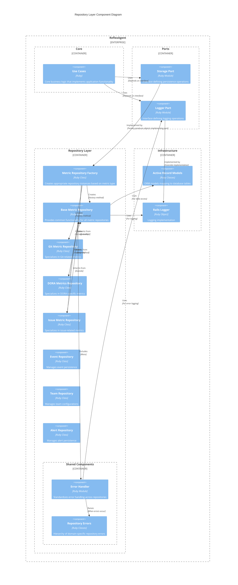
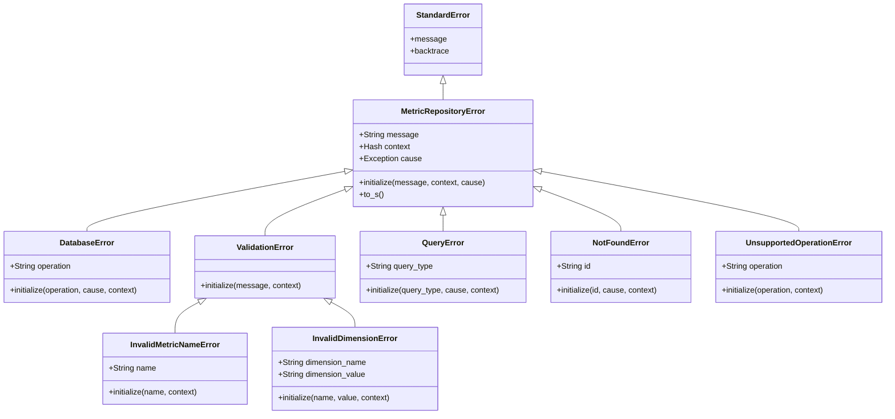
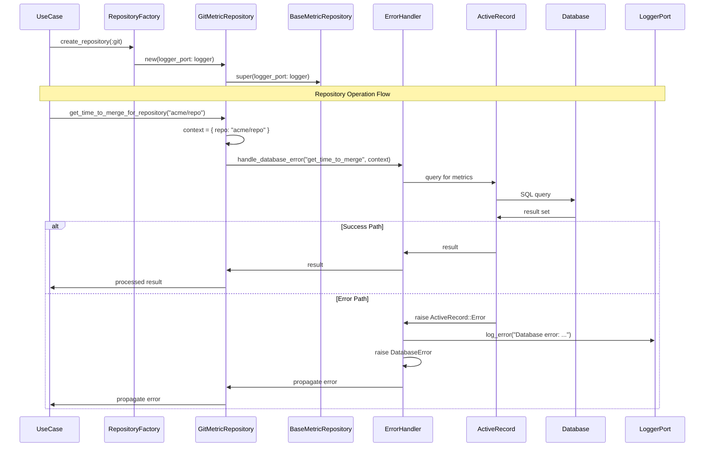

# Repository Layer Component Diagram

This diagram shows the component structure of the repository layer in ReflexAgent.

## Repository Components Diagram

## Repository Error Hierarchy Diagram

## Repository Method Flow Diagram

