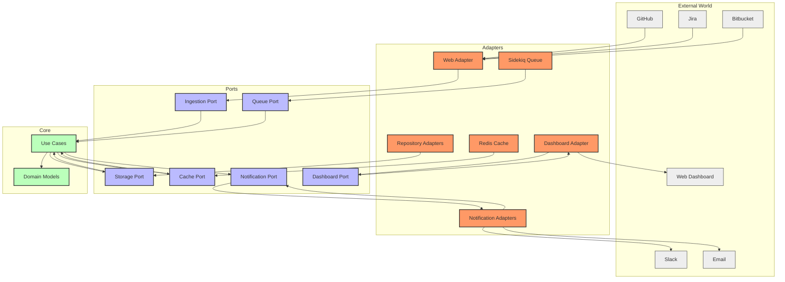
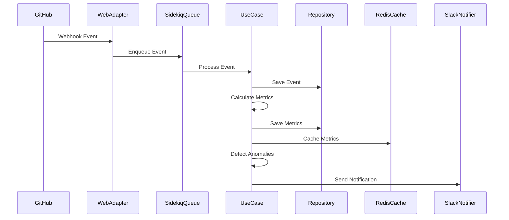
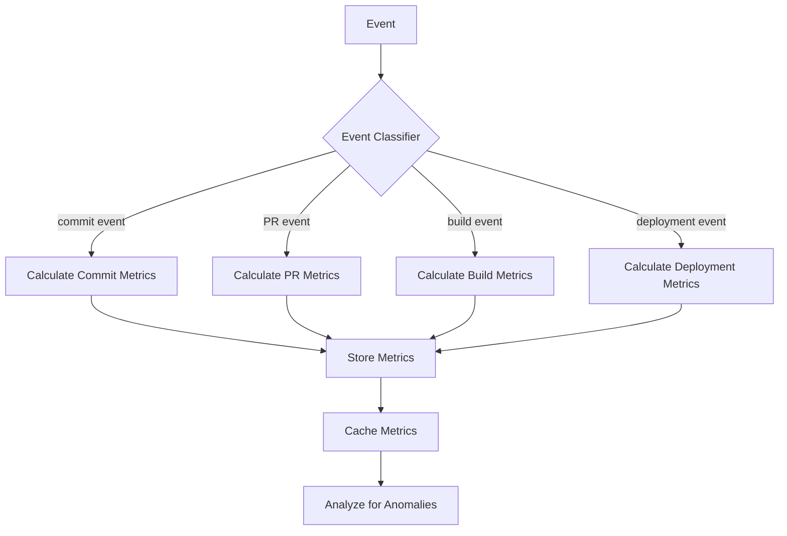
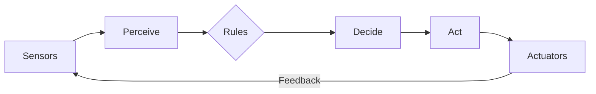

# Architecture Documentation for ReflexAgent

This document provides an overview of the Hexagonal (Ports & Adapters) architecture implemented in ReflexAgent, guiding developers through the core concepts, directory layout, and key guidelines.

> **Navigation**: [Documentation Index](../README.md) | [Domain Documentation](../domain/README.md) | [Technical Documentation](../technical/README.md) | [Operations Documentation](../operations/README.md)

## 1. Architectural Overview

ReflexAgent implements the Hexagonal/Ports & Adapters pattern to achieve:

- **Separation of Concerns**: Business logic (core) is isolated from frameworks and infrastructure.
- **Testability**: Core use cases and domain models are framework-agnostic and can be unit tested with mock ports.
- **Replaceability**: Infrastructure components (Rails, Redis, Sidekiq, Slack, Python services) can be swapped by implementing different adapters without touching core logic.

### 1.1 High-Level Architecture Diagram



### 1.2 Data Flow



## 2. Current Implementation 

### 2.1 Directory Layout

```
ReflexAgent/
├── app/
│   ├── core/
│   │   ├── domain/                 # Plain Ruby domain models
│   │   │   ├── classifiers/        # Event classifiers
│   │   │   ├── extractors/         # Dimension extractors
│   │   │   ├── event.rb            # Event model
│   │   │   ├── metric.rb           # Metric model
│   │   │   ├── alert.rb            # Alert model
│   │   │   ├── reflexive_agent.rb  # Agent model
│   │   │   └── ...
│   │   ├── use_cases/              # Application business logic
│   │   │   ├── calculate_metrics.rb
│   │   │   ├── detect_anomalies.rb
│   │   │   ├── process_event.rb
│   │   │   ├── send_notification.rb
│   │   │   └── ...
│   │   └── use_case_factory.rb     # Factory for instantiating use cases
│   │
│   ├── ports/                      # Interface definitions (Ruby modules)
│   │   ├── ingestion_port.rb
│   │   ├── storage_port.rb
│   │   ├── cache_port.rb
│   │   ├── notification_port.rb
│   │   ├── queue_port.rb
│   │   ├── dashboard_port.rb
│   │   ├── team_repository_port.rb
│   │   └── logger_port.rb
│   │
│   └── adapters/
│       ├── web/                    # Rails Controllers → IngestionPort
│       │   └── web_adapter.rb
│       ├── repositories/           # ActiveRecord implementations → StoragePort
│       │   ├── event_repository.rb
│       │   ├── metric_repository.rb
│       │   ├── alert_repository.rb
│       │   └── team_repository.rb
│       ├── cache/                  # Cache implementations → CachePort
│       │   ├── redis_cache.rb
│   │   │   └── event_lru_cache.rb
│       ├── notifications/          # Notification systems → NotificationPort
│       │   ├── slack_notifier.rb
│       │   └── email_notifier.rb
│       ├── queuing/                # Job queue systems → QueuePort
│       │   └── sidekiq_queue_adapter.rb
│       └── dashboard/              # UI interfaces → DashboardPort
│           └── dashboard_adapter.rb
├── config/
│   └── initializers/
│       └── dependency_injection.rb # Wiring ports to adapters
```

### 2.2 Ports and Adapters Registry

The following table shows the current port-to-adapter mapping:

| Port | Adapter(s) | Description |
|------|------------|-------------|
| **IngestionPort** | `Web::WebAdapter` | Receives events from webhooks and API endpoints |
| **StoragePort** | `Repositories::EventRepository`<br>`Repositories::MetricRepository`<br>`Repositories::AlertRepository` | Stores and retrieves domain objects |
| **CachePort** | `Cache::RedisCache` | Caches metrics and computed values |
| **NotificationPort** | `Notifications::SlackNotifier`<br>`Notifications::EmailNotifier` | Sends notifications to external systems |
| **QueuePort** | `Queuing::SidekiqQueueAdapter` | Manages background job processing |
| **DashboardPort** | `Dashboard::DashboardAdapter` | Provides data to UI components |
| **TeamRepositoryPort** | `Repositories::TeamRepository` | Manages team configurations |
| **LoggerPort** | `Rails.logger` | Provides logging capabilities |

## 3. Core Concepts

### 3.1 Domain Models

ReflexAgent's core domain models are implemented as plain Ruby objects without framework dependencies:

- **Event**: Represents an occurrence in the system that is worth tracking
- **Metric**: Represents a calculated value derived from events
- **Alert**: Represents a notification triggered when a metric crosses a threshold
- **ReflexiveAgent**: Represents an autonomous agent with perception and action capabilities

### 3.2 Ports

Ports define the contracts/interfaces that the core depends on:

```ruby
module IngestionPort
  def receive_event(raw_payload, source:)
    raise NotImplementedError
  end
  
  def validate_webhook_signature(payload, signature)
    raise NotImplementedError
  end
end
```

### 3.3 Adapters

Adapters provide concrete implementations of ports, interacting with external systems:

```ruby
module Web
  class WebAdapter
    include IngestionPort
    
    def receive_event(raw_payload, source:)
      # Implementation that converts raw webhooks into domain events
    end
  end
end
```

### 3.4 Dependency Injection

The `DependencyContainer` class wires ports to adapters at runtime:

```ruby
# In config/initializers/dependency_injection.rb
DependencyContainer.register(
  :ingestion_port,
  Web::WebAdapter.new(logger_port: logger_port)
)
```

Use cases access adapters through the container:

```ruby
# In a use case
@ingestion_port = DependencyContainer.resolve(:ingestion_port)
```

## 4. Implementation Details

### 4.1 Event Processing Pipeline

1. External systems send events via webhooks to `WebAdapter`
2. Events are converted to domain events and enqueued with `SidekiqQueueAdapter`
3. Background workers process events using the appropriate use cases
4. Metrics are calculated from events and stored/cached
5. Anomalies are detected by analyzing metrics
6. Notifications are sent via the appropriate notification adapter

### 4.2 Metrics Calculation

The metrics calculation process:



### 4.3 Reflexive Agent Architecture

The ReflexiveAgent operates through a perception-action cycle:



## 5. Guidelines & Best Practices

- **No Framework Code in Core**: Keep `app/core/` free from Rails, ActiveRecord, or other framework dependencies.
- **Keep Ports Lean**: Port interfaces should define only method signatures without implementation logic.
- **Adapters as Thin Wrappers**: Each adapter should adapt the external API to the port interface without adding business logic.
- **Use Case Orchestration**: Business logic should be orchestrated in use cases, not in adapters or controllers.
- **Test Each Layer**: 
  - **Unit Tests**: Test domain models and use cases with mock ports.
  - **Integration Tests**: Test adapters against actual external systems or test doubles.
  - **E2E Tests**: Test complete flows from external events to notifications.

## 6. Related Documentation

- [Domain Model](../domain/README.md): Core domain concepts and entities
- [Event Processing Pipeline](event_processing_pipeline.md): Detailed flow of events
- [C4 Component Diagram](C4/c4_component_diagram.md): Component-level architecture diagrams
- [Architecture Decision Records](ADR/): Rationale for key architectural decisions

---

*Last updated: June 27, 2024*

