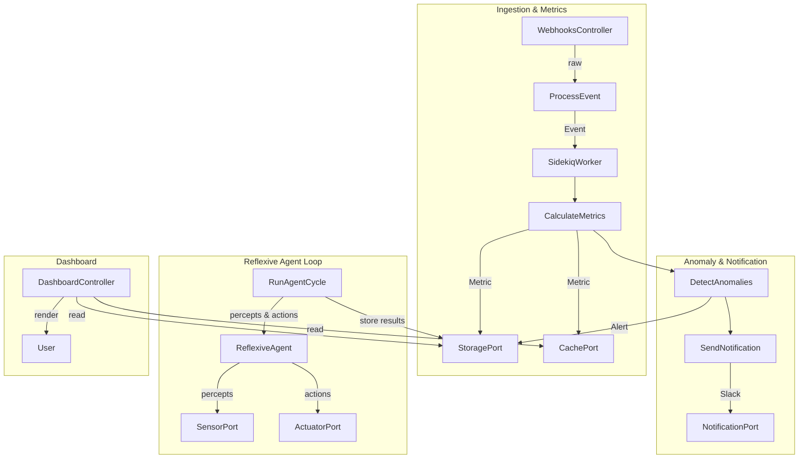

# Domain Logic Overview for ReflexAgent

This document provides a comprehensive view of the core domain logic in ReflexAgent, detailing the key models, ports, use cases, and their interactions.

---

## 1. Domain Models (Plain Ruby Objects)

### 1.1 `Event`
Represents a raw occurrence in the system (e.g., a GitHub push or Jira ticket transition).

```ruby
module Core
  module Domain
    class Event
      attr_reader :source, :payload, :received_at
      # source: String (e.g., "github", "jira")
      # payload: Hash of event data
      # received_at: Time
    end
  end
end
```

### 1.2 `Metric`
Captures a single measurement derived from one or more events (e.g., cycle time, PR-review time).

```ruby
module Core
  module Domain
    class Metric
      attr_reader :name, :value, :calculated_at
      # name: String (e.g., "cycle_time")
      # value: Float
      # calculated_at: Time
    end
  end
end
```

### 1.3 `Alert`
Signals that a Metric breached a threshold, triggering downstream notifications or interventions.

```ruby
module Core
  module Domain
    class Alert
      attr_reader :metric, :status, :triggered_at
      # metric: Metric
      # status: String (e.g., "triggered")
      # triggered_at: Time
    end
  end
end
```

### 1.4 `ReflexiveAgent`
Encapsulates a perception-action loop for AI-driven behaviors (e.g., similarity queries, “what-if” simulations).

```ruby
module Core
  module Domain
    class ReflexiveAgent
      attr_reader :name, :sensors, :actuators, :rules
      # name: String
      # sensors: [SensorPort]
      # actuators: [ActuatorPort]
      # rules: { Condition→Action }
      
      # perceive_and_act → { percepts:…, actions:… }
      # add_rule / add_sensor / add_actuator mutate its configuration
    end
  end
end
```

---

## 2. Ports (Interfaces)

The Core depends purely on these abstract interfaces:

- **IngestionPort** → `receive_event(raw_payload)  ⇒ Event`
- **StoragePort**  → `save_event(event)`, `save_metric(metric)`, `save_alert(alert)`, `fetch_threshold_for(name)`
- **CachePort**    → `write(key, value)`, `read(key)  ⇒ value`
- **QueuePort**    → `enqueue(event_or_job)`
- **NotificationPort** → `send(alert_or_message)`
- **DashboardPort** → `fetch_metrics  ⇒ [Metric]`, `fetch_alerts  ⇒ [Alert]`
- **SensorPort**   → `perceive  ⇒ Hash` (percepts)
- **ActuatorPort** → `execute(action)`

---

## 3. Use Cases (Orchestration)

1. **`ProcessEvent`**
   - Inputs raw payload via IngestionPort.
   - Creates an `Event` and enqueues it via QueuePort for asynchronous handling.

2. **`CalculateMetrics`**
   - Runs inside a background job.
   - Consumes an `Event`, computes new `Metric`(s), saves via StoragePort, caches via CachePort.

3. **`DetectAnomalies`**
   - After computing a Metric, fetches that metric’s threshold, compares values.
   - If breached, constructs an `Alert`, persists via StoragePort, and returns it.

4. **`SendNotification`**
   - Given an `Alert`, uses NotificationPort to push a Slack message (or other channel).

5. **`RunAgentCycle`** (new Use Case wrapping `ReflexiveAgent`)
   - Resolves all configured sensors/actuators via ports.
   - Instantiates a `ReflexiveAgent(name:, sensors:, actuators:, rules:)`.
   - Calls `perceive_and_act`, then optionally persists resulting percepts/actions as Metrics or Alerts.

---

## 4. End-to-End Flow



1. **Webhook arrives** → `ProcessEvent` → **enqueue**
2. **Worker** pulls job → `CalculateMetrics` → persist & cache
3. Scheduled all some minutes: `DetectAnomalies` → if threshold crossed → `Alert` → `SendNotification`
4. On demand or schedule, a `RunAgentCycle` Use Case can trigger AI-driven perception & action via your `ReflexiveAgent` model and record those outcomes.
5. **Dashboard** reads cached metrics and stored alerts to give teams real-time visibility.

---

## 5. How `ReflexiveAgent` Ties In

- **Sensors**: Wrap ports like `DashboardPort` (to fetch current metrics) or a `ChromaPort` (to load embeddings).
- **Actuators**: Include a `NotificationPort` (to nudge teams based on AI insight) or a `StoragePort` (to record new recommendations as Metrics).
- **Rules**: Drive conditional logic, e.g.:  
  ```ruby
  condition = ->(percepts) { percepts["cycle_time"] > percepts["cycle_time_mean"] * 2 }
  action    = :suggest_pairing
  agent.add_rule(condition, action)
  ```

With this clear separation—Domain Models + Ports + Use Cases + Adapters—you ensure that **every piece of business logic** (including your AI-agent reflex loop) is pure, testable, and decoupled from framework concerns.

