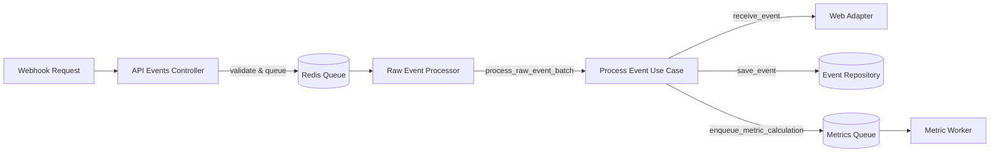
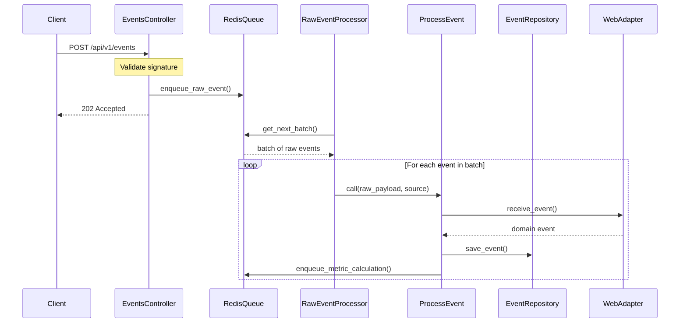

# Event Processing Pipeline Architecture

This document describes the high-performance event processing pipeline implemented in ReflexAgent, designed to handle high-throughput webhook events from various sources.

## Overview

The event processing pipeline is designed with these key principles:

1. **Quick Webhook Acknowledgment**: Webhooks are acknowledged immediately with a 202 Accepted response
2. **Minimal Web Request Processing**: Web requests do minimal work (just validate and queue)
3. **Asynchronous Processing**: Events are processed asynchronously by workers
4. **Backpressure Handling**: The system can handle bursts of traffic and apply backpressure when needed
5. **High Availability**: The system is designed to survive service restarts

## Key Components

### 1. Event Reception Layer

The event reception layer is implemented in `app/controllers/api/v1/events_controller.rb`:

- Validates the webhook signature
- Performs minimal JSON validation
- Immediately queues the raw event in Redis
- Returns 202 Accepted to the client
- Handles backpressure with 429 Too Many Requests response if needed

### 2. Message Queue System

The message queue system is implemented in `app/adapters/queue/redis_queue_adapter.rb`:

- Uses Redis lists as queues
- Applies TTLs to ensure queue data doesn't grow unbounded
- Implements backpressure mechanisms
- Provides batch processing capabilities
- Handles dead-letter queues for failed events

The system maintains separate queues for:
- Raw webhook events
- Event processing
- Metric calculation
- Anomaly detection

### 3. Event Processor Workers

Raw event processing is handled by `app/jobs/raw_event_processor_job.rb`:

- Processes batches of events from the queue
- Handles errors gracefully with retry logic
- Scales horizontally by running multiple workers
- Auto-restarts to ensure continuous processing

### 4. Use Cases and Domain Logic

The core business logic is isolated in the use cases:

- `app/core/use_cases/process_event.rb`: Transforms raw events into domain events, persists them, and enqueues for metric calculation
- Additional use cases for metric calculation and anomaly detection

## Configuration

Redis queue settings can be adjusted in `app/adapters/queue/redis_queue_adapter.rb`:

- `MAX_QUEUE_SIZE`: Controls when backpressure is applied
- `BATCH_SIZE`: Controls how many events are processed in each batch
- `QUEUE_TTL`: Controls how long events live in the queue (default: 3 days)

## Performance Considerations

1. **Redis Connection Pool**: We use a connection pool to manage Redis connections and ensure thread safety
2. **Batched Processing**: Events are processed in batches for efficiency
3. **Minimal Web Request Processing**: Web requests do minimal work to keep response times low
4. **Error Handling**: Robust error handling ensures system stability
5. **Monitoring**: Queue depths and processing rates should be monitored

## Sequence Diagram

## Error Handling

The system implements multiple layers of error handling:

1. **Web Controller**: Catches all exceptions and returns appropriate HTTP status codes
2. **Queue Adapter**: Implements dead-letter queues for failed events
3. **Event Processor**: Handles worker crashes and implements retry logic
4. **Process Event Use Case**: Handles individual event failures without affecting the entire batch

## Monitoring

To monitor the pipeline health, observe:

1. **Queue Depths**: Monitor `RedisQueueAdapter#queue_depths`
2. **Processing Rates**: Track events/second through metrics
3. **Error Rates**: Monitor exceptions and dead-letter queue size
4. **Latency**: Track time from reception to full processing 