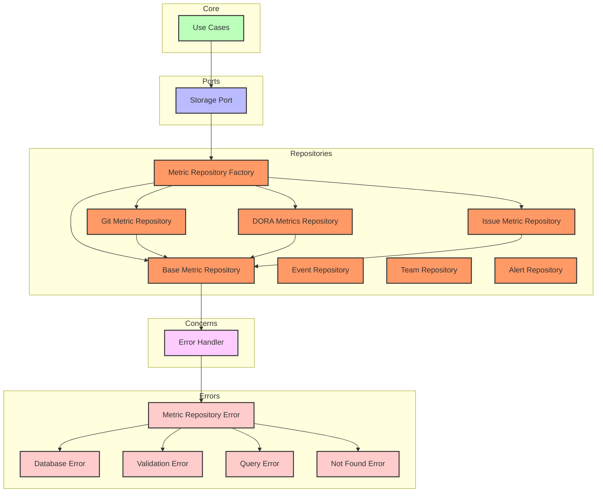
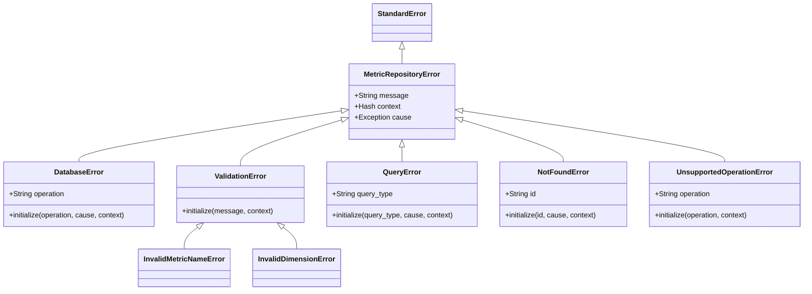

# Repository Architecture in ReflexAgent

This document outlines the repository architecture used in ReflexAgent, providing a comprehensive guide to our implementation of the repository pattern within the hexagonal architecture.

> **Navigation**: [Architecture Documentation](README.md) | [Domain Documentation](../domain/README.md) | [Technical Documentation](../technical/README.md)

## 1. Overview

The repository layer in ReflexAgent serves as an adapter between the domain/core business logic and the database. It implements the `StoragePort` interface and provides persistence capabilities for our domain models while abstracting the underlying database implementation details.

### 1.1 Repository Architecture Diagram



## 2. Repository Pattern Implementation

### 2.1 Repository Interfaces

Our implementation includes the following repositories:

| Repository Type | Purpose |
|----------------|---------|
| `BaseMetricRepository` | Provides common metric CRUD operations and shared functionality |
| `GitMetricRepository` | Specializes in Git-related metrics (commits, PRs, branches) |
| `DoraMetricsRepository` | Handles DORA-specific metrics (lead time, deployment frequency, etc.) |
| `IssueMetricRepository` | Manages issue-related metrics and calculations |
| `EventRepository` | Stores and retrieves event data |
| `TeamRepository` | Manages team configuration and relationships |
| `AlertRepository` | Handles alert storage and retrieval |

### 2.2 Factory Pattern

The `MetricRepositoryFactory` creates the appropriate repository based on the metric type:

```ruby
# Sample usage of the factory:
repository = MetricRepositoryFactory.create_repository(:git)
repository.find_by_pattern(entity: 'commit', action: 'time_to_merge')
```

## 3. Error Handling

All repositories implement a consistent error handling approach through the `ErrorHandler` concern. This provides:

1. Standardized error types with appropriate context
2. Consistent logging with proper error details
3. Domain-specific errors that are decoupled from infrastructure exceptions

### 3.1 Error Hierarchy



### 3.2 Error Handler Methods

The `ErrorHandler` concern provides the following methods:

- `handle_database_error`: For managing database-related exceptions
- `handle_not_found`: For handling "record not found" scenarios
- `handle_query_error`: For managing query and SQL-related errors
- `validate_metric`: For ensuring metrics meet domain requirements
- `validate_dimensions`: For validating dimension structures
- `handle_unsupported_operation`: For operations not supported by a repository

## 4. Usage Examples

### 4.1 Basic CRUD Operations

```ruby
# Create a new metric
metric = Domain::Metric.new(
  name: "git.commit.time_to_merge",
  value: 86400, # 1 day in seconds
  source: "github",
  dimensions: { "repo" => "acme/project", "pr_number" => "123" },
  timestamp: Time.now
)

# Save the metric
saved_metric = repository.save_metric(metric)

# Find a metric by ID
found_metric = repository.find_metric(saved_metric.id)

# Update a metric
updated_metric = found_metric.with_value(43200) # 12 hours in seconds
repository.update_metric(updated_metric)

# List metrics with filters
metrics = repository.list_metrics(
  name: "git.commit.time_to_merge",
  source: "github",
  start_time: 1.week.ago,
  end_time: Time.now,
  dimensions: { "repo" => "acme/project" }
)
```

### 4.2 Using the GitMetricRepository

```ruby
# Create a Git repository instance
git_repo = MetricRepositoryFactory.create_repository(:git, logger_port: Rails.logger)

# Get average time to merge for a specific repository
avg_time = git_repo.get_time_to_merge_for_repository("acme/project")

# Get all recent commit metrics
commits = git_repo.find_recent_commit_metrics("acme/project", days: 30)

# Get pull request metrics
pr_metrics = git_repo.get_pull_request_metrics(
  repository: "acme/project",
  start_time: 1.month.ago,
  end_time: Time.now
)

# Get repository activity metrics
activity = git_repo.get_repository_activity("acme/project", days: 14)
```

### 4.3 Using the DoraMetricsRepository

```ruby
# Create a DORA metrics repository instance
dora_repo = MetricRepositoryFactory.create_repository(:dora, logger_port: Rails.logger)

# Get deployment frequency
deploy_freq = dora_repo.get_deployment_frequency(
  team: "platform-team",
  start_time: 1.month.ago,
  end_time: Time.now
)

# Get change failure rate
failure_rate = dora_repo.get_change_failure_rate(
  team: "platform-team",
  start_time: 3.months.ago,
  end_time: Time.now
)

# Get mean time to recovery
mttr = dora_repo.get_mean_time_to_recovery(
  service: "payment-api",
  start_time: 6.months.ago,
  end_time: Time.now
)

# Get lead time for changes
lead_time = dora_repo.get_lead_time_for_changes(
  team: "platform-team",
  start_time: 1.month.ago,
  end_time: Time.now
)
```

### 4.4 Using the IssueMetricRepository

```ruby
# Create an issue metrics repository instance
issue_repo = MetricRepositoryFactory.create_repository(:issue, logger_port: Rails.logger)

# Get time to resolve issues
resolution_time = issue_repo.get_time_to_resolution(
  project: "payment-system",
  priority: "high",
  start_time: 3.months.ago,
  end_time: Time.now
)

# Get issue creation rate
creation_rate = issue_repo.get_issue_creation_rate(
  project: "payment-system",
  start_time: 1.month.ago,
  end_time: Time.now
)

# Get issue backlog metrics
backlog = issue_repo.get_backlog_metrics(
  team: "platform-team",
  as_of: Time.now
)
```

## 5. Query Patterns and Best Practices

### 5.1 Recommended Query Patterns

When working with repositories, follow these query patterns:

1. **Use Specific Methods Over Generic Ones**: Prefer specific finder methods like `find_by_pattern()` over raw database queries.
2. **Filter Early**: Always narrow your result set as early as possible with time ranges and dimensions.
3. **Use Time Windows**: Always specify start and end times to limit the data volume.
4. **Be Dimension-Aware**: Filter by dimensions to get relevant subsets of metrics.

### 5.2 Performance Considerations

Our repositories implement several performance optimizations:

1. **Caching**: In-memory caching for frequently accessed metrics.
2. **Indexing**: Database indices on commonly queried fields.
3. **Query Optimization**: Custom query builders for complex metric retrieval.
4. **Pagination**: Support for limiting result sets to manageable sizes.

### 5.3 Repository Best Practices

When extending or using repositories:

1. **Error Handling**: Always use the provided error handler methods.
2. **Validation**: Validate inputs before performing database operations.
3. **Domain Isolation**: Keep repositories focused on persistence, not business logic.
4. **Consistent Interfaces**: Follow the established method naming patterns.
5. **Testing**: Use repository double/mock in unit tests, real repos in integration tests.

## 6. Testing Repositories

Repositories can be tested at multiple levels:

1. **Unit Tests**: Test repository methods in isolation using factory-created models.
2. **Integration Tests**: Test repository interactions with the actual database.
3. **Factory Tests**: Ensure the factory creates the right repository type.

Example test approach:

```ruby
RSpec.describe Repositories::GitMetricRepository do
  let(:repository) { described_class.new(logger_port: logger_double) }
  
  describe "#find_by_pattern" do
    before do
      # Set up test data
    end
    
    it "returns metrics matching the pattern" do
      # Test implementation
    end
    
    it "handles error cases" do
      # Test error handling
    end
  end
end
```

## 7. Extending the Repository Layer

### 7.1 Adding a New Repository

To add a new repository type:

1. Create a new class in `app/adapters/repositories/`
2. Inherit from `BaseMetricRepository` if appropriate
3. Include the `ErrorHandler` concern
4. Register the new repository type in `MetricRepositoryFactory`
5. Implement the required methods based on your domain needs

### 7.2 Adding Methods to Existing Repositories

When adding new methods:

1. Follow the consistent error handling pattern
2. Consider performance implications
3. Add appropriate tests
4. Update documentation

## 8. References and Related Documentation

- [Domain Model Documentation](domain_model.md)
- [Metrics Naming Convention](metrics_naming_convention.md)
- [Metrics Indexing Strategy](metrics_indexing_strategy.md)
- [ADR-0005: Metric Naming Convention](ADR/ADR-0005-metric-naming-convention.md) 