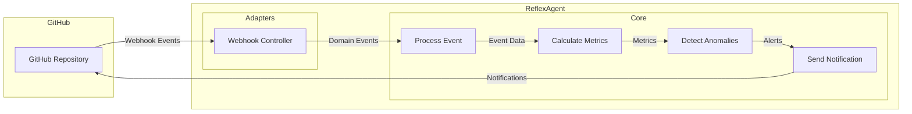

# Dogfooding: Monitoring Our Own GitHub Repository

This document explains how ReflexAgent is set up to monitor its own GitHub repository, providing a real-world example of event processing and alerting.

## What is Dogfooding?

"Eating your own dog food" (dogfooding) is the practice of using your own product to validate its quality and usefulness. For ReflexAgent, this means processing events from our own GitHub repository and using the resulting metrics and alerts to improve both the codebase and the development process.

## Architecture Overview



## Setup Instructions

### 1. Deploy to Render

The application is automatically deployed to Render using our GitHub Actions workflow. The deployment is defined in the `render.yaml` Blueprint file, which creates:

- A web service for the Rails application
- A worker service for Sidekiq
- PostgreSQL database
- Redis instance

### 2. Configure GitHub Webhook

The deployment workflow automatically configures a webhook from the GitHub repository to the deployed application. This is handled by the following step in `.github/workflows/deploy.yml`:

```yaml
- name: Configure GitHub Webhooks
  env:
    GH_TOKEN: ${{ secrets.GH_PAT_TOKEN }}
    WEBHOOK_URL: ${{ secrets.RENDER_WEBHOOK_URL }}
    WEBHOOK_SECRET: ${{ secrets.WEBHOOK_SECRET }}
  run: |
    # Configure GitHub webhook to send events to your ReflexAgent deployment
    curl -X POST \
      -H "Accept: application/vnd.github.v3+json" \
      -H "Authorization: token $GH_TOKEN" \
      https://api.github.com/repos/${{ github.repository }}/hooks \
      -d '{
        "name": "web",
        "active": true,
        "events": ["push", "pull_request", "issues", "issue_comment", "pull_request_review"],
        "config": {
          "url": "'"$WEBHOOK_URL"'/api/v1/events?source=github",
          "content_type": "json",
          "secret": "'"$WEBHOOK_SECRET"'"
        }
      }'
```

### 3. Securely Store Webhook Secret

The webhook secret is used to verify that events are coming from GitHub. The secret is stored as:

1. A GitHub Actions secret (`WEBHOOK_SECRET`)
2. An environment variable in the Render deployment

### 4. Verify Webhook Configuration

To verify that the webhook is properly configured:

1. Go to your GitHub repository
2. Navigate to Settings > Webhooks
3. You should see a webhook pointing to your deployed application
4. Check the "Recent Deliveries" tab to ensure events are being delivered

## Example Metrics Tracked

The ReflexAgent monitors the following metrics from its own repository:

1. **PR Cycle Time**: Time from PR creation to merge
2. **PR Size**: Number of files/lines changed per PR
3. **PR Review Time**: Time spent in review status
4. **Issue Resolution Time**: Time from issue creation to close
5. **Commit Frequency**: Number of commits per day/week
6. **Code Velocity**: Rate of code changes over time
7. **Test Coverage**: Automated test coverage metrics

## Anomaly Detection

Based on the collected metrics, ReflexAgent detects anomalies such as:

1. Unusually large PRs
2. PRs with minimal review
3. Slow-moving issues
4. Sudden spikes or drops in development activity
5. Changes to critical files

## Self-Improvement Loop

The dogfooding setup creates a feedback loop where:

1. The team uses ReflexAgent to monitor development
2. Anomalies in the development process are detected
3. Alerts trigger improvements to code or processes
4. These improvements are committed back to the repository
5. The improved ReflexAgent monitors these new changes

This continuous improvement cycle helps ensure both the quality of the ReflexAgent codebase and the effectiveness of its monitoring capabilities. 