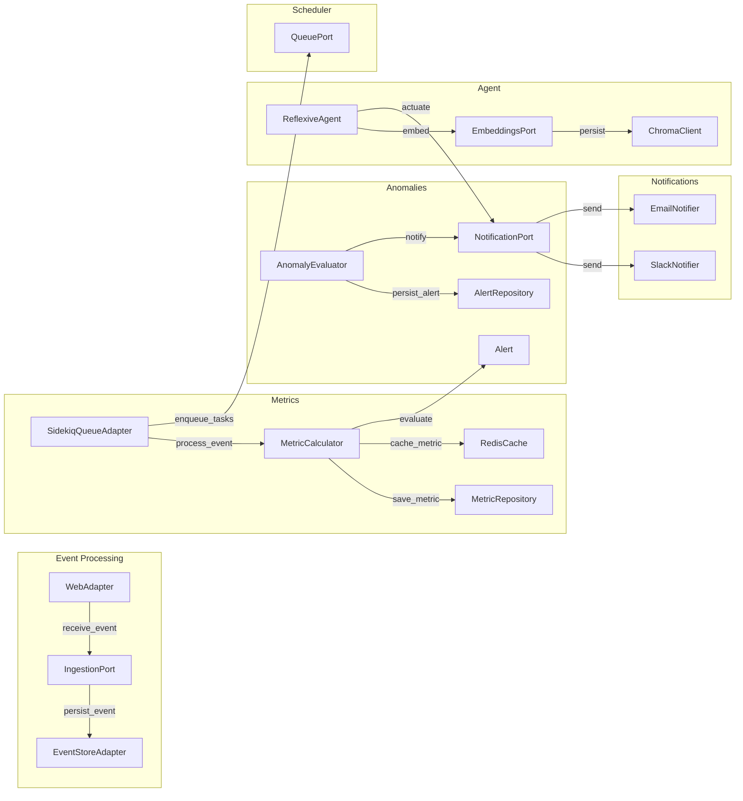

# Domain-Driven Design & Hexagonal Architecture for ReflexAgent

This document outlines both the Domain-Driven Design (DDD) and its concrete realization in a Hexagonal (Ports & Adapters) architecture for the ReflexAgent application. It covers bounded contexts, aggregates, services, repositories (ports), and adapters for each context.

---

## 1. Bounded Contexts & Aggregates

| Context               | Aggregate Root | Entities / Value Objects                                      |
| --------------------- | -------------- | ------------------------------------------------------------- |
| **Event Processing**  | DomainEvent    | DomainEvent (id, source, payload, timestamp)                  |
| **Metrics**           | MetricSnapshot | MetricSnapshot (id, name, value, recordedAt)                  |
| **Anomaly Detection** | Alert          | Alert (id, metricName, value, threshold, status, triggeredAt) |
| **Notification**      | Notification   | Notification (id, alertId, channel, payload, sentAt)          |
| **Agent**             | ReflexiveAgent | ReflexiveAgent (name, sensors, actuators, rules)              |

---

## 2. Domain Services

| Service                | Responsibility                                     |
| ---------------------- | -------------------------------------------------- |
| EventNormalizer        | Convert raw payload → DomainEvent                  |
| MetricCalculator       | Compute MetricSnapshot from DomainEvent            |
| AnomalyEvaluator       | Generate Alert from MetricSnapshot and AnomalyRule |
| NotificationDispatcher | Send Notification based on Alert                   |
| AgentOrchestrator      | Run perception-action cycles with ReflexiveAgent   |

---

## 3. Ports & Adapters Mapping

Below each port interface (contract) is paired with its adapters:

### 3.1 Event Processing Context

* **Port**: `Ports::IngestionPort`
* **Adapter**: `WebAdapter` (Rails controllers under `app/adapters/web/`)
* **Port**: `Ports::EventStorePort`
* **Adapter**: `EventStoreAdapter` (ActiveRecord `DomainEventRepository`)

### 3.2 Metrics Context

* **Port**: `Ports::StoragePort` (for Metric persistence)
* **Adapter**: `MetricRepository` (ActiveRecord `MetricSnapshotRecord`)
* **Port**: `Ports::CachePort`
* **Adapter**: `RedisCache` (under `app/adapters/cache/`)

### 3.3 Anomaly Detection Context

* **Port**: `Ports::StoragePort` (for threshold lookup and Alert persistence)
* **Adapter**: `AlertRepository` (ActiveRecord `AlertRecord`)
* **Port**: `Ports::NotificationPort`
* **Adapter**: `SlackNotifier`, `EmailNotifier` (under `app/adapters/notifications/`)

### 3.4 Notification Context

* **Port**: `Ports::NotificationPort`
* **Adapters**:

  * `SlackNotifier`
  * `EmailNotifier`
  * (future: `TeamsNotifier`)

### 3.5 Agent Context

* **Port**: `Ports::EmbeddingsPort`
* **Adapter**: `ChromaClient` (under `app/adapters/embeddings/`)
* **Port**: `Ports::IngestionPort` (for sensor data)
* **Adapter**: `DashboardAdapter` (UI sensor via `app/adapters/web/dashboard_controller`)
* **Port**: `Ports::NotificationPort` (for actuator actions)

### 3.6 Task Queue & Job Scheduling

* **Port**: `Ports::QueuePort`
* **Adapter**: `SidekiqQueueAdapter` (under `app/adapters/queuing/`)

---

## 4. Dependency Injection

All ports are wired to their adapters in `config/initializers/dependency_injection.rb`:

```ruby
Rails.application.config.to_prepare do
  IngestionPortImpl       = WebAdapter.new
  EventStorePortImpl      = EventStoreAdapter.new
  StoragePortImpl         = MetricRepository.new
  CachePortImpl           = RedisCache.new
  NotificationPortImpl    = SlackNotifier.new
  QueuePortImpl           = SidekiqQueueAdapter
  EmbeddingsPortImpl      = ChromaClient.new
end
```

---

## 5. Architectural Diagram



---

*Last updated: 2025-05-07*
