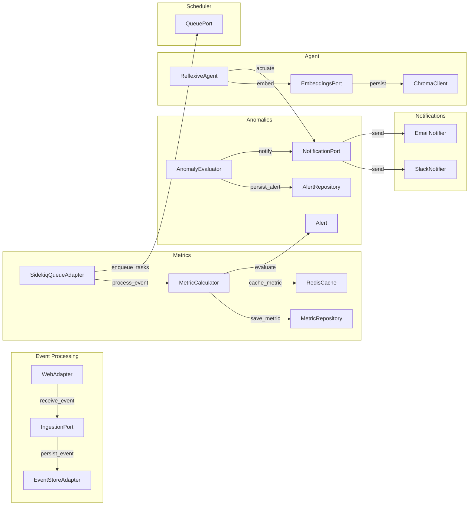

# Domain-Driven Design & Hexagonal Architecture for ReflexAgent

This document outlines both the Domain-Driven Design (DDD) and its concrete realization in a Hexagonal (Ports & Adapters) architecture for the ReflexAgent application. It covers bounded contexts, aggregates, services, repositories (ports), and adapters for each context.

> **Navigation**: [Documentation Index](../README.md) | [Architecture Overview](../architecture/README.md) | [Technical Documentation](../technical/README.md) | [Event Processing Pipeline](../architecture/event_processing_pipeline.md)

---

## 1. Bounded Contexts & Aggregates

| Context               | Aggregate Root | Entities / Value Objects                                      | Related Documentation |
| --------------------- | -------------- | ------------------------------------------------------------- | -------------------- |
| **Event Processing**  | DomainEvent    | DomainEvent (id, source, payload, timestamp)                  | [Event Pipeline](../architecture/event_processing_pipeline.md), [Webhooks](../webhooks/README.md) |
| **Metrics**           | MetricSnapshot | MetricSnapshot (id, name, value, recordedAt)                  | [Metrics Indexing](../architecture/metrics_indexing_strategy.md), [Dashboard](../technical/dashboard.md) |
| **Anomaly Detection** | Alert          | Alert (id, metricName, value, threshold, status, triggeredAt) | [Services](../technical/services.md#anomaly-detection-service) |
| **Notification**      | Notification   | Notification (id, alertId, channel, payload, sentAt)          | [ADR-0004](../architecture/ADR/ADR-0004.md) |
| **Agent**             | ReflexiveAgent | ReflexiveAgent (name, sensors, actuators, rules)              | [Technical Debt - God Class](../technical/debt_analysis.md#high-severity) |

---

## 2. Domain Services

| Service                | Responsibility                                     | Implementation |
| ---------------------- | -------------------------------------------------- | -------------- |
| EventNormalizer        | Convert raw payload → DomainEvent                  | `app/core/domain/event_factory.rb` |
| MetricCalculator       | Compute MetricSnapshot from DomainEvent            | `app/core/use_cases/calculate_metrics.rb` |
| AnomalyEvaluator       | Generate Alert from MetricSnapshot and AnomalyRule | `app/core/use_cases/detect_anomalies.rb` |
| NotificationDispatcher | Send Notification based on Alert                   | `app/core/use_cases/send_notification.rb` |
| AgentOrchestrator      | Run perception-action cycles with ReflexiveAgent   | `app/core/use_cases/actuator_controller.rb` |

See more details in the [Services Documentation](../technical/services.md).

---

## 3. Ports & Adapters Mapping

Below each port interface (contract) is paired with its adapters:

### 3.1 Event Processing Context

* **Port**: `Ports::IngestionPort`
* **Adapter**: `WebAdapter` (Rails controllers under `app/adapters/web/`)
* **Port**: `Ports::EventStorePort`
* **Adapter**: `EventStoreAdapter` (ActiveRecord `DomainEventRepository`)

### 3.2 Metrics Context

* **Port**: `Ports::StoragePort` (for Metric persistence)
* **Adapter**: `MetricRepository` (ActiveRecord `MetricSnapshotRecord`)
* **Port**: `Ports::CachePort`
* **Adapter**: `RedisCache` (under `app/adapters/cache/`)

### 3.3 Anomaly Detection Context

* **Port**: `Ports::StoragePort` (for threshold lookup and Alert persistence)
* **Adapter**: `AlertRepository` (ActiveRecord `AlertRecord`)
* **Port**: `Ports::NotificationPort`
* **Adapter**: `SlackNotifier`, `EmailNotifier` (under `app/adapters/notifications/`)

### 3.4 Notification Context

* **Port**: `Ports::NotificationPort`
* **Adapters**:

  * `SlackNotifier`
  * `EmailNotifier`
  * (future: `TeamsNotifier`)

### 3.5 Agent Context

* **Port**: `Ports::EmbeddingsPort`
* **Adapter**: `ChromaClient` (under `app/adapters/embeddings/`)
* **Port**: `Ports::IngestionPort` (for sensor data)
* **Adapter**: `DashboardAdapter` (UI sensor via `app/adapters/web/dashboard_controller`)
* **Port**: `Ports::NotificationPort` (for actuator actions)

### 3.6 Task Queue & Job Scheduling

* **Port**: `Ports::QueuePort`
* **Adapter**: `SidekiqQueueAdapter` (under `app/adapters/queuing/`)

For implementation details, see the [Architecture Overview](../architecture/README.md) and [Technical Documentation](../technical/debt_analysis.md).

---

## 4. Dependency Injection

All ports are wired to their adapters in `config/initializers/dependency_injection.rb`:

```ruby
Rails.application.config.to_prepare do
  IngestionPortImpl       = WebAdapter.new
  EventStorePortImpl      = EventStoreAdapter.new
  StoragePortImpl         = MetricRepository.new
  CachePortImpl           = RedisCache.new
  NotificationPortImpl    = SlackNotifier.new
  QueuePortImpl           = SidekiqQueueAdapter
  EmbeddingsPortImpl      = ChromaClient.new
end
```

---

## 5. Architectural Diagram



For a more detailed architecture view, see the [C4 Component Diagram](../architecture/C4/c4_component_diagram.md).

## Related Documentation

- [Architecture Overview](../architecture/README.md) - Detailed architecture explanation
- [Event Processing Pipeline](../architecture/event_processing_pipeline.md) - How events flow through the system
- [Technical Debt](../technical/debt_analysis.md) - Current issues and improvement plans
- [Detailed Domain Model](detailed_model.md) - Detailed domain model specification

---

*Last updated: June 27, 2024*
