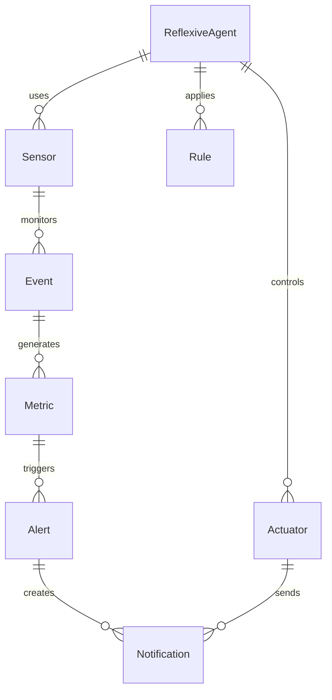

# Detailed Domain Model

This document provides a detailed specification of the domain model for ReflexAgent, expanding on the overview provided in the [Domain Overview](README.md).

> **Navigation**: [Documentation Index](../README.md) | [Domain Overview](README.md) | [Architecture](../architecture/README.md) | [Technical Documentation](../technical/README.md)

## Core Domain Entities

### Event

The `Event` entity represents an occurrence in the system that is worth tracking. Events are the primary input to the system and drive all metric calculations and notifications.

```ruby
class Event
  attr_reader :id, :source, :event_type, :timestamp, :payload, :aggregate_id
  
  def initialize(id:, source:, event_type:, timestamp:, payload:, aggregate_id:)
    @id = id
    @source = source
    @event_type = event_type
    @timestamp = timestamp
    @payload = payload
    @aggregate_id = aggregate_id
  end
  
  # Methods for event classification and data extraction
  def classify
    # ...
  end
  
  def extract_dimensions
    # ...
  end
end
```

### Metric

The `Metric` entity represents a calculated value derived from events. Metrics are used to track performance, identify trends, and detect anomalies.

```ruby
class Metric
  attr_reader :id, :name, :value, :dimensions, :timestamp, :calculation_period
  
  def initialize(id:, name:, value:, dimensions:, timestamp:, calculation_period:)
    @id = id
    @name = name
    @value = value
    @dimensions = dimensions
    @timestamp = timestamp
    @calculation_period = calculation_period
  end
  
  # Methods for metric analysis and comparison
  def rolling_average(window:)
    # ...
  end
  
  def trend(window:)
    # ...
  end
end
```

### Alert

The `Alert` entity represents a notification triggered when a metric crosses a threshold or exhibits anomalous behavior.

```ruby
class Alert
  attr_reader :id, :metric_id, :threshold, :value, :status, :triggered_at, :resolved_at
  
  def initialize(id:, metric_id:, threshold:, value:, status:, triggered_at:, resolved_at: nil)
    @id = id
    @metric_id = metric_id
    @threshold = threshold
    @value = value
    @status = status
    @triggered_at = triggered_at
    @resolved_at = resolved_at
  end
  
  def resolve
    @status = :resolved
    @resolved_at = Time.now
  end
  
  def acknowledge
    @status = :acknowledged
  end
end
```

### ReflexiveAgent

The `ReflexiveAgent` entity represents an autonomous agent that can perceive, decide, and act based on rules and current state.

```ruby
class ReflexiveAgent
  attr_reader :id, :name, :sensors, :actuators, :rules
  
  def initialize(id:, name:, sensors:, actuators:, rules:)
    @id = id
    @name = name
    @sensors = sensors
    @actuators = actuators
    @rules = rules
  end
  
  def perceive
    # Collect data from sensors
  end
  
  def decide
    # Apply rules to current state
  end
  
  def act
    # Trigger actuators based on decisions
  end
end
```

## Domain Services

### MetricCalculator

The `MetricCalculator` service calculates metrics from events.

```ruby
class MetricCalculator
  def initialize(event_repository, metric_repository)
    @event_repository = event_repository
    @metric_repository = metric_repository
  end
  
  def calculate(event_id)
    event = @event_repository.find(event_id)
    metrics = []
    
    # Calculate metrics based on event type
    case event.event_type
    when :pull_request_created
      metrics << calculate_pr_metrics(event)
    when :commit_pushed
      metrics << calculate_commit_metrics(event)
    # ...
    end
    
    # Persist metrics
    metrics.each do |metric|
      @metric_repository.save(metric)
    end
    
    metrics
  end
  
  private
  
  def calculate_pr_metrics(event)
    # ...
  end
  
  def calculate_commit_metrics(event)
    # ...
  end
end
```

### AnomalyDetector

The `AnomalyDetector` service analyzes metrics to detect anomalies and generate alerts.

```ruby
class AnomalyDetector
  def initialize(metric_repository, alert_repository, notification_service)
    @metric_repository = metric_repository
    @alert_repository = alert_repository
    @notification_service = notification_service
  end
  
  def detect_anomalies(metric_id)
    metric = @metric_repository.find(metric_id)
    
    # Check for anomalies using various algorithms
    if is_anomalous?(metric)
      alert = create_alert(metric)
      @notification_service.notify(alert)
      return alert
    end
    
    nil
  end
  
  private
  
  def is_anomalous?(metric)
    # Apply anomaly detection algorithms
    # ...
  end
  
  def create_alert(metric)
    alert = Alert.new(
      id: generate_id,
      metric_id: metric.id,
      threshold: calculate_threshold(metric),
      value: metric.value,
      status: :triggered,
      triggered_at: Time.now
    )
    
    @alert_repository.save(alert)
    alert
  end
end
```

## Domain Relationships

The following diagram illustrates the relationships between the key domain entities:



## Domain Aggregates

The domain model is organized into the following aggregates:

1. **Event Aggregate**
   - Root: Event
   - Components: EventType, EventSource, EventPayload

2. **Metric Aggregate**
   - Root: Metric
   - Components: MetricName, MetricDimensions, MetricValue

3. **Alert Aggregate**
   - Root: Alert
   - Components: AlertThreshold, AlertStatus

4. **Agent Aggregate**
   - Root: ReflexiveAgent
   - Components: Sensor, Actuator, Rule

## Related Documentation

- [Domain Overview](README.md) - High-level domain concepts and bounded contexts
- [Event Processing Pipeline](../architecture/event_processing_pipeline.md) - How events flow through the system
- [Technical Implementation](../technical/services.md) - Service implementations
- [API Documentation](../api/README.md) - How to interact with domain objects via API

---

*Last updated: June 27, 2024*

